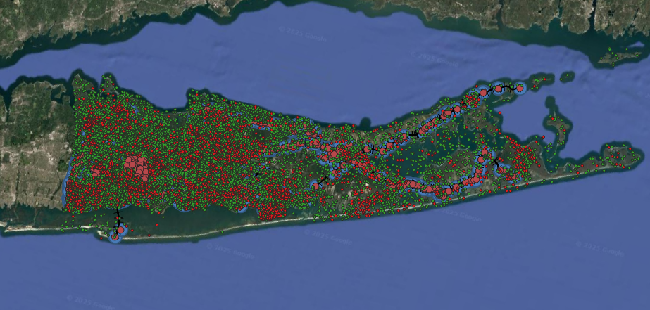

#  🚌 Suffolk County Transit's Data Analysis using GIS and Python

**SCT's Case Study: Unpacking Transit Revenue Performance, Operational Trends, Route Analysis, and the Socioeconomic Impact of Service Coverage in High-Poverty Areas.**

---

## 📄 Overview

This project presents an in-depth data analysis case study of Suffolk County Transit (SCT). Driven by personal observations of SCT's punctuality and extensive coverage as a daily commuter, this work assesses the agency's effectiveness in serving Suffolk County, recognized as the largest easternmost county in the USA.

The comprehensive analysis is structured into three distinct phases: an examination of bus ridership trends, a review of SCT's performance measures and operational characteristics, and a detailed bus route analysis including GIS visualization and an assessment of its social demographic impact, particularly concerning poverty areas.

### 1. Bus Ridership Demographics (2013-2016)

This initial phase explores bus ridership trends and patterns between 2013 and 2016, utilizing data from opendata.suffolk. This involved:
* Loading raw ridership data.
* Creating a dedicated 'Date' column for robust time-series analysis.
* Calculating 'Total_Ridership' by accurately summing various fare types.
* Generating visualizations to show total monthly ridership fluctuations.
* Illustrating the overall distribution of ridership by specific fare type.

### 2. SCT Performance Measures and Operational Characteristics (2013-2023)

The second part focuses on evaluating SCT's efficiency, productivity, and fleet health over a longer period, from 2013 to 2023. Data was sourced from the Federal Transit Administration (FTA) Annual Agency Profiles. Key analytical steps included:
* Cleaning and preparing numerical operational data for analysis.
* Calculating essential performance indicators, such as 'Operating Expense per Vehicle Revenue Mile'.
* Visualizing trends in these KPIs (Key Performance Indicators).
* Analyzing year-over-year changes in broader operational metrics and fleet characteristics.

### 3. SCT Bus Route Analysis, GIS Visualization, and Social Demographic Impact

This final and most central part of the project links SCT bus routes to crucial demographic data, particularly focusing on poverty. This phase involved:
* Integrating bus stops and route shapes from GTFS data.
* Incorporating town and hamlet polygons for local administrative context.
* Adding census tracts as foundational spatial units for demographic data.
* Utilizing Python to join population and poverty attributes from American Community Survey (ACS) data with census tracts.
* Creating choropleth maps to visually represent the distribution of poverty rates.
* Developing dot density maps to illustrate population and poverty concentrations, with poverty distinctly highlighted in red.
* Generating buffer zones around bus routes to visually represent service corridors.
* Performing demographic overlays to understand the relationship between bus infrastructure and socioeconomic characteristics, notably poverty.

## Complete Visualization of SCT

Here's an example of the GIS visualization integrating SCT routes with demographic overlays:

## 💡 Key Findings

Our analysis revealed a moderate positive correlation (0.43) between the average poverty rate of a route's stops and its total number of trips (frequency). Intriguingly, routes serving the highest 25% poverty areas demonstrated a slightly higher average of 102 total trips, compared to the overall system average of 96 trips. This indicates that, on average, service frequency in high-poverty areas is comparable to or even slightly higher than the overall system average.

However, a deeper dive into the highest poverty quartile identified specific routes, such as Route 77Y (17 total trips) and Route 80 (47 total trips), which operate with significantly lower frequencies than the system average. These outliers present targeted opportunities for service enhancement. Ultimately, our analysis confirmed that Suffolk County Transit effectively provides service coverage within Suffolk, the region's largest easternmost county—a finding both curiously insightful and thankfully reassuring.

## 🔗 Full Project Details

For a deeper dive into the methodology and complete analysis, please visit my Medium article:

[Summer Project 1: Analyzing Suffolk County Transit with QGIS & Python](https://medium.com/@vummadiharsha123/summer-project-1-analyzing-suffolk-county-transit-with-qgis-python-9482692bbb80)

---
---
